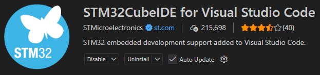
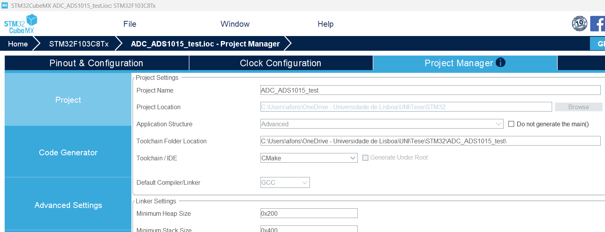
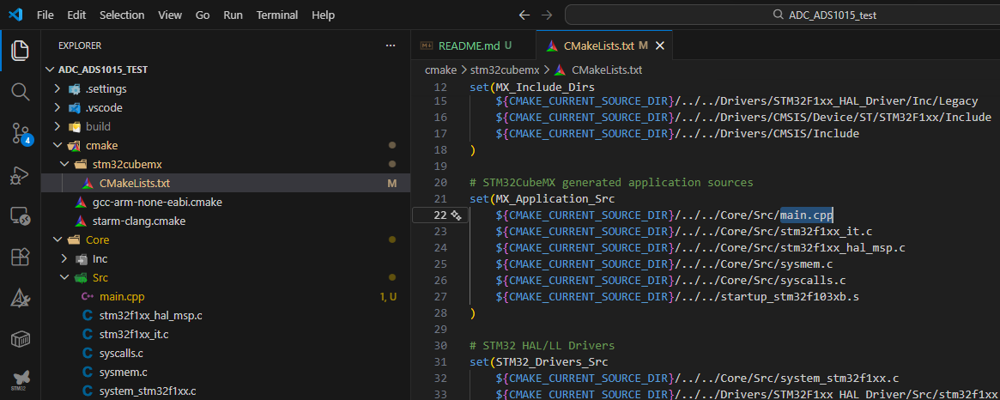
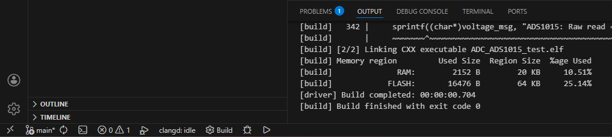
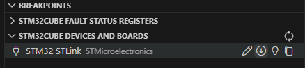
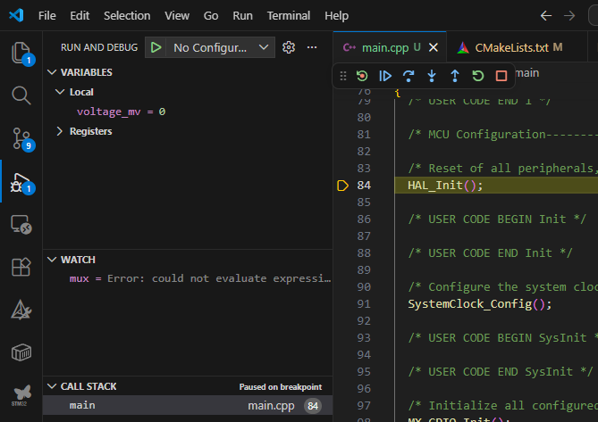
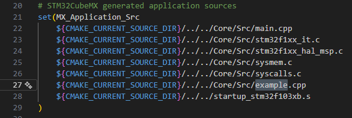

## How to run and debug STM32 devices in VScode

### Instalation
1. Install VScode;
2. Install the extension "STM32CubeIDE for Visual Studio Code";
<div align="center">
  
</div>
3. Intall STM32CubeMX (and STM32CubeMX2 for certain partnumbers);

### Config
1. Launch STM32CubeMX;
2. Config the MCU as you want;
3. Than go to "Project Manager" tab, insertt the name of the project and location, and finaly select CMake on the "Toolchain/IDE" option;
<div align="center">
  
</div>
4. Click generate code;

#### Change to cpp: If you want to change from C to C++ you need to change the main.c to .cpp and in CMakeLists.txt change the reference to main.c to main.cpp

<div align="center">
  
</div>

### Build
1. Change the code as you like, for example togle an LED to test:
```c
int main(void){
    ......
    while (1){
        HAL_GPIO_TogglePin(LED_GPIO_Port, LED_Pin);
        HAL_Delay(1000);
  }
}

```
2. On the down left coner, select build. If the code does not have errors, you should see the folowing message:
<div align="center">
  
</div>

### Run and Debug
1. Select the Run and Debug icon on the left bar or "C"trl + Shit+ D";
2. Conect your device with a ST-link;
3. The device should apear in "STM32CUBE DEVICES AND BOARDS":
<div align="center">
  
</div>
4. Click on the arrow to Upgrade the ST-Link firmware (you do not need to do this step every time);
5. Click Run and Debug;
6. If everything runs correctly, the DEEBUG CONSOLE should open automaticaly and the Debug bar should apear too;

<div align="center">
  
</div>

7. On the debug bar you can select some options to run and debug the code;
8. When you are finished, just select stop and unplug the device.

### Serial prints
1. Conect a UART to serial convert to your device;
2. Than "Ctrl + shift + P", "Open serial", "COMx", "115200" (adjust the COM port and bound rate to your aplication);

## Create a library
### 1 Easy way

1. Add a new cpp/c file to Core/Src and a h file to Core/Inc;
2. On cpp/c place your functions and include the header file;
```c
#include "example.h"
```
3. On h file you need to place all includes, defines, macros, structs, etc. that you neeed and the defenition of the functions described in cpp file;
```c
#ifndef __EXAMPLE_H
#define __EXAMPLE_H

#ifdef __cplusplus
extern "C" {
#endif
/*-----Includes-----*/ 
#include <stdint.h>
....

/*-----Macros-----*/ 
#define SERIAL_DEBUG 1
....

/*-----Functions-----*/ 
void example(void);

#ifdef __cplusplus
}
#endif

#endif 
```
5. Add the directory of the new cpp file to CMakeLists.txt
<div align="center">
  
</div>

6. Include your new header file in main.h;
```c
#include "example.h"
```
### 2 Professional way
Add a folder called lib. For libs like can lib which are used in many projects, use git submodules to clone an updated version of that lib every time you clone it. Se [Gitcommands.md](https://gitlab.rnl.tecnico.ulisboa.pt/tecnicosb/se/tutorials/-/blob/master/Gitcommands.md?ref_type=heads).

I did not try this with STM32 framework but I will. It should not be hard to set up.

## STM32 tutorials
Best tutorials that I have ever found. Deepblue mbedded: [Link](https://deepbluembedded.com/stm32-arm-programming-tutorials/)

