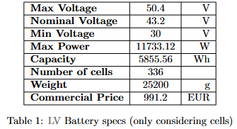
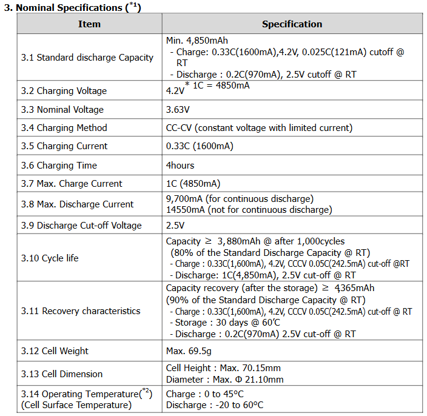
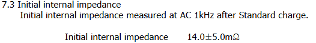

# Bat specs

Configuration: 12s28p

Internal resistance = 14 * 12 / 28 = 6 mOhm

Charge current cutoff = 0.025 * 1C * 28 = 0.7 * 4.850 = 3.395 A

Cells: [Samsung INR21700-50G](samsung-inr21700-50g-datasheet.pdf)

