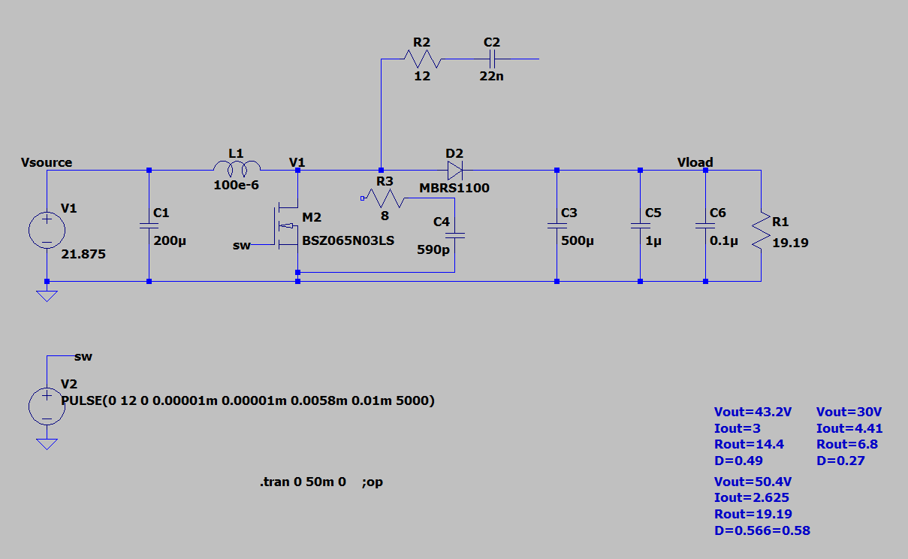
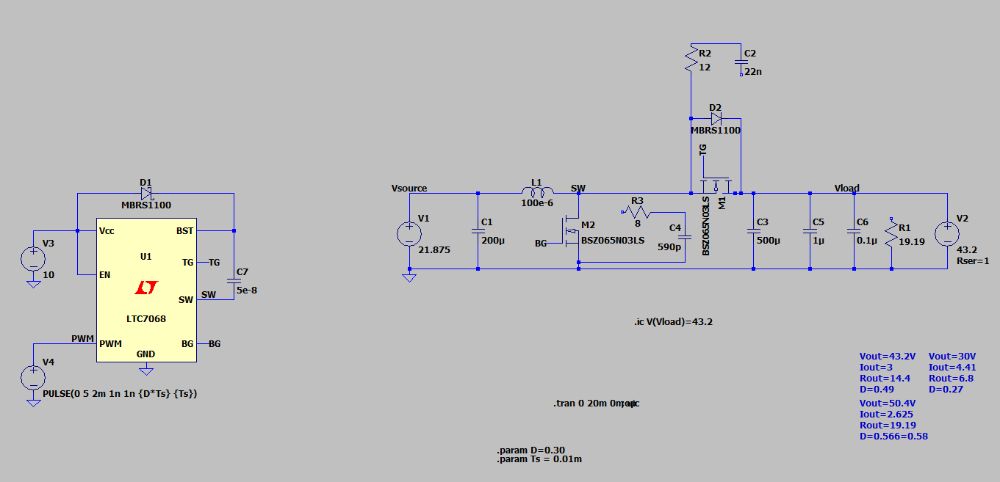

# LTspice simulations

## Simulations evolution 

Before these simulations, some simulations were done in Matlab however Matlab is not so relaible for electronics simulations. Additionally LTspice let us simulate with the components models provided by the manufacture which increases even more the reliability of the simulation. The only problem, is that LTspice is old, and it was not made for microcontrollers, so we can not test the MPPT algorithm. For an initial stage this is not a problem, however for that type of simulations the best choice is even Matlab simulink or Qspice.

**V1**: The first simulations were done with a basic boost converter. The some generic components were chosen and constant load were used. The load is equivalent to the impedance of the battery which is calculated with ohms law.

  

**V2**: In this version i tried to make synchronous boost converter. The gate driver was ok but it generates a lot of oscilations.

  

**V3**: In this version I staled in the EPC23102 (transistor+gate driver). Two versions of these simulations were made, one with ideal components and another with the components models of Wurth Elektonik. In these simulations the model of a solar panel was implemented for the first time giving a set further to the real system and making easier to describe the load. Now the load is described as a voltage source with a series resistance (equivalent to the internal resistance of the batteries).

  

Right now the curves are similar, however i added two capacitors in the input to filter the high frequency spikes generated in the simulation with non ideal components.

**What is next:**
- Simulate the circuit for different points of the i-V curve (already done it but i did not analyze it)
- Calculate the power losses
- Extract the data to a .txt file for future analysis with Matlab

## Spice Models

### Solar panel model

Explanation: https://www.youtube.com/watch?v=uV_z1ptufa4

How to do it on LTspice: https://www.youtube.com/watch?v=ox0UtYe4owI

  

### Inductor and capacitor model
Wurth libs: https://github.com/WurthElektronik/LTspice-Library/tree/master

Capacitor: https://www.we-online.com/en/components/products/WCAP-ATUL?sq=860040881014#860040881014

100uF, 100V -> 860040875005

220uF, 100V -> 860040878017

Capacitor (input): https://www.we-online.com/en/components/products/WCAP-HTG5?sq=870575875006#870575875006

56uF, 100V -> 870575875006

Inductor: https://www.we-online.com/en/components/products/WE-HCF?sq=74437529203680#74437529203680

100uH, 8.2A -> 74437429203101 -> 2920_74437429203101_100u  (model name)

68uH, 16A -> 74437529203680 -> 2920_74437529203680_68u (model name)

47uH, 17.5A -> 74437529203470 -> 2920_74437529203470_47u (model name)

33uH, 34.95A -> 7443643300 -> 2818_7443643300_33u (model name)

22uH, 44A -> 74436412200 -> 2815_74436412200_22u
## How to add components

### .lib (Wurth Elektronik)

1. Download the .zip folder containing the LTspice files;
2. Unzip;
3. Place in a directory where LTspice can find;

  

4. Now you can use as a normal component;

    1. Open components tab;
    2. Select the component; 
    3. Place it;

5.  **Important:** some libs files have more than one model. So you need to right click on the component and change the SpiceModel as you like;

  

6. To know the name of the model, open the .lib/.xlsm file in a text editor and find the model you need.

  
  

