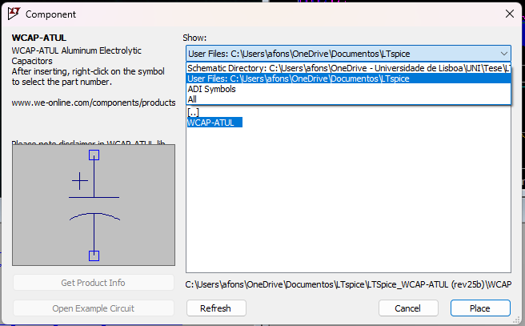
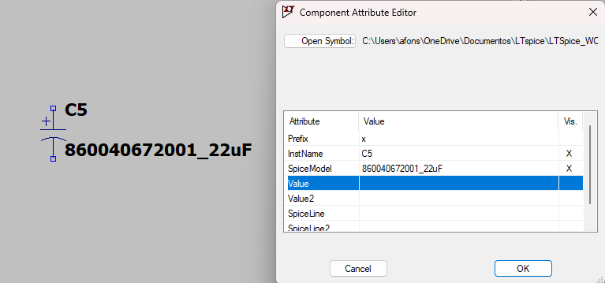
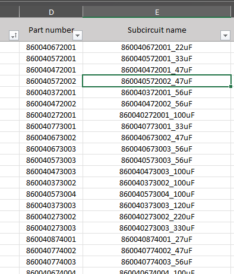
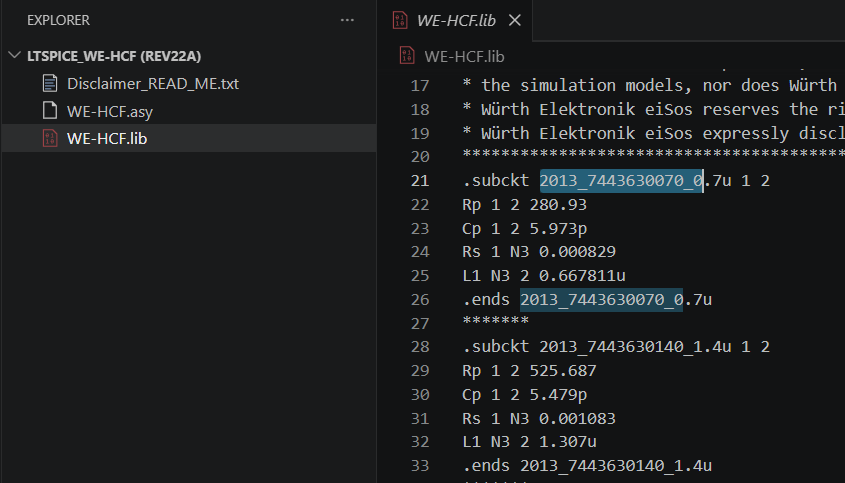

# LTspice simulations

## Solar panel model

Explanation: https://www.youtube.com/watch?v=uV_z1ptufa4

How to do it on LTspice: https://www.youtube.com/watch?v=ox0UtYe4owI

## Inductor and capacitor model
Wurth libs: https://github.com/WurthElektronik/LTspice-Library/tree/master

Capacitor: https://www.we-online.com/en/components/products/WCAP-ATUL?sq=860040881014#860040881014

100uF, 100V -> 860040875005

Inductor: https://www.we-online.com/en/components/products/WE-HCF?sq=74437529203680#74437529203680

68uH, 16A -> 74437529203680

47uH, 17.5A -> 74437529203470

## How to add components

### .lib (Wurth Elektronik)

1. Download the .zip folder containing the LTspice files;
2. Unzip;
3. Place in a directory where LTspice can find;

  

4. Now you can use as a normal component;

    1. Open components tab;
    2. Select the component; 
    3. Place it;

5.  **Important:** some libs files have more than one model. So you need to right click on the component and change the SpiceModel as you like;

  

6. To know the name of the model, open the .lib/.xlsm file in a text editor and find the model you need.

  
  

